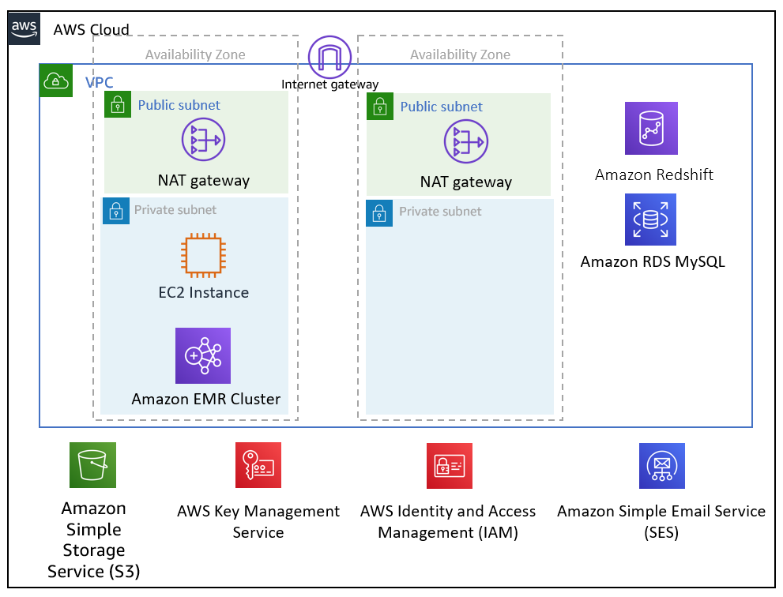

Deploying this Quick Start for a new VPC with
default parameters builds the following {partner-company-name} {partner-product-name} environment in the
AWS Cloud.

// Replace this example diagram with your own. Send us your source PowerPoint file. Be sure to follow our guidelines here : http://(we should include these points on our contributors giude)
[#architecture1]
.Quick Start architecture for {partner-product-name} on AWS
[link=images/architecture_diagram.png]

As shown in Figure 1, the Quick Start sets up the following:

* A VPC configured with public and private subnets, according to AWS best practices, to provide you with your own virtual network on AWS.footnote:note[The template that deploys the Quick Start into an existing VPC skips the components marked by asterisks and prompts you for your existing VPC configuration.]
* An Amazon S3 bucket used by {partner-company-name} to store extracted and transformed data.
* Four AWS Identity and Access Management (IAM) roles:

** One attached to the {partner-company-name} Amazon EC2 instance.
** One attached to the Amazon EMR cluster nodes.
** One used by Amazon EMR for auto-scaling.
** One used to access data in the Amazon S3 bucket.

* Two AWS Key Management Service (KMS) keys in different AWS regions used to encrypt secrets within {partner-company-name}.
* In the public subnets:

** A managed network address translation (NAT) gateway to allow outbound internet access for resources in the private subnets.footnote:note[]
** An Amazon EC2 instance running {partner-company-name}.

* In the private subnets:

** An Amazon Relational Database Service (Amazon RDS) MySQL database used by {partner-company-name} to store metadata.
** An Amazon EMR cluster used by {partner-company-name} to run extractions and transformations.
